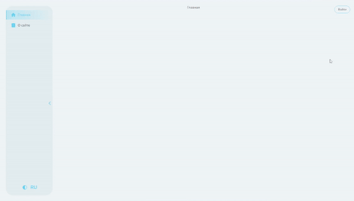

## react-blog

>***
React-blog is a simulation of a social blog where you can log in and see a list of articles. Also you can rate articles and comment them. The app has info about your profile which cand be edited. The main idea of the project is to use different approaches and libriaries to improve skills of front-end developer.
The design of the project can be found [here](https://www.figma.com/design/UfS42XWKWPNagbgWkv7aer/Production-ULBI-TV?node-id=20531-2&node-type=canvas&t=ohD1byGqbRkDF69U-0)
***

# Project details

## Bundlers

Project has 2 type of bundlers: 

1. [Webpack](https://webpack.js.org)
2. [Vite](https://vite.dev)

All of webpack config parts are separated by different files (functions inside) to make build more comfortable. Build parts of Webpack can be found in ***config/build***

Scripts:

- `npm run start:final:webpack` - start webpack config + server launch
- `npm run start:final:vite` - start vite config + server launch

## Structure

Project uses FSD (feature-sliced-design) structure. The main idea behind it is to make the project more understandable and stable in the face of ever-changing business requirements.

Details can be found [here](https://feature-sliced.design/docs/get-started/overview)

Scripts:

- `npm run generate` - special script to create layer and slice. Write layer name and slice name after `generate`. 

For example:  `npm run generate entities User`. It will create layer and slice according to script details which can be found in ***scripst/createFSD***

## Store 

[Redux Toolkit](https://redux-toolkit.js.org) is used to work with store. Reused entities are normallized by `createEntityAdapter`.

To use reducers dynamically (to put them in store when they are needed only) [DynamicReducerLoader](src/shared/lib/components/DynamicReducerLoader/DynamicReducerLoader.tsx) is used. 

## Translations

i18next-library is used to work with translations proprely. Translation files are saved in ***public/locales***. Documentation can be found [here](https://feature-sliced.design/docs/get-started/overview)

## Tests 

Project has 2 types of tests:

1. Unit with [Jest](https://jestjs.io)
2. Component tests with [React-testing-library](https://testing-library.com/docs/react-testing-library/intro/)

Scripts:

- `npm run jest-unit` - Run unit tests

## Linters and formatters

There are 3 types of linters in this project:

1. [ESlint](https://eslint.org) to fix all `.ts` and `.tsx` files
2. [Stylelint](https://stylelint.io) to fix all `.scss` files
3. [Prettier](https://prettier.io) to properly format files

Scripts:

- `npm run eslint` - Check `.ts` and `.tsx` files for problems
- `npm run eslint:fix` - Fix problems in `.ts` and `.tsx` files
- `npm run stylelint` - Check `.scss` files for problems
- `npm run stylelint:fix` - Fix problems in `.scss` files
- `npm run prettier:check` - Check formatting problems in files
- `npm run prettier:write` - Fix formatting problems in files
- `npm run start:all:linters` - Launch all linters one by one (with `fix`)

## CI and Pipeline

Github actions configuration can be found in ***.github/workflows***. It contains linting, RTL tests and building project jobs.

Project also has a husky pre-commit hook which can be found in ***.husky*** folder. It lints and formats files which are put in index before commit them. It is started automatically when you try to commit changes.
